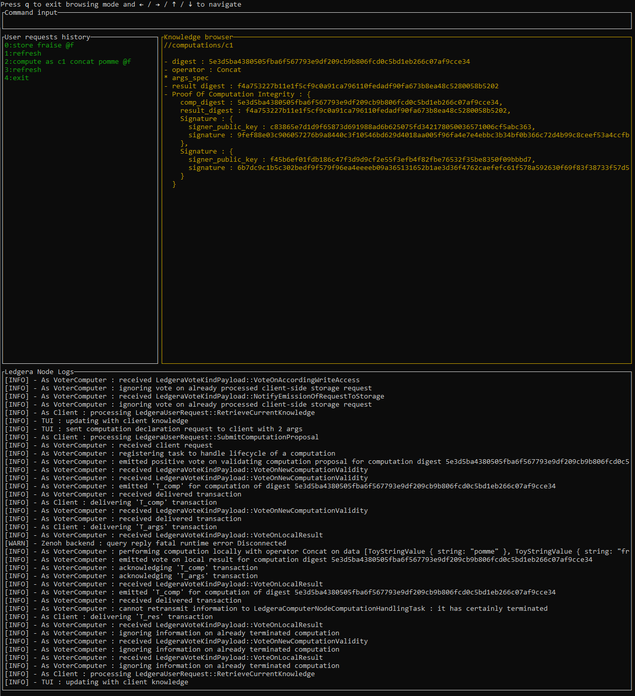

# Ledgera Demo TUI

This crate implements a simple Text User Interface (TUI) for Ledgera Clients.
See the [TUI description on the website](https://docs.ledgera.tech/docs/versions/v_0_1/5_user_interface/) for details.

## Description (TODO update/detail)

The TUI has the following layout : 

At the top the current input which is a text edition area in which the user may enter
the commands they want to send to ledgera.

Below that there is some Ledgera-specific information:
- on the left the history of the previous commands
- on the right a browser to explore the client's knowledge of the system i.e.:
  - known promises of storages
  - which computations it knows about and their status
  - known proofs of integrity for computations 
  - etc

Below that we have the log (from "log" crate) of the local Ledgera Node on which the client is running.

## Interface Modes

The TUI operates in three distinct modes:

### **Main Menu Mode** (Default)
- Starting point when you launch the TUI
- **Controls:**
  - `e` → Enter **Edition mode** to type commands
  - `b` → Enter **Browser mode** to explore client knowledge  
  - `q` → Quit and terminate the node
  - `h` → Show TUI help (commands, syntax)
  - `o` → Show computation operations help (available operations/predicates for compute based on use case)

### **Edition Mode** 
- Interactive command input for Ledgera operations
- **Controls:**
  - Type commands and press `ENTER` to execute
  - Type `exit` and press `ENTER` to return to Main Menu
- **Available commands:** `store`, `compute`, `push_arg`, `get_value`, `refresh`, `rename` (explained in detail in the help)

### **Browser Mode**
- Navigate and inspect the client's knowledge of the system
- **Controls:**
  - Arrow keys (`↑↓←→`) to navigate the knowledge tree
  - `q` → Return to Main Menu
- **Browse:**   
  - known promises of storages
  - which computations it knows about and their status
  - known proofs of integrity for computations 
  - etc